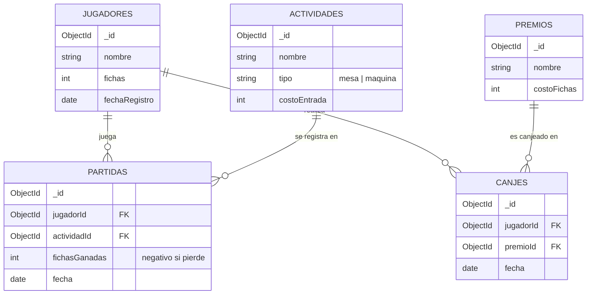

# Base de Datos — Casino & Arcade Híbrido

## Motor de base de datos
MongoDB

## Descripción del modelo

El proyecto simula un casino/arcade que opera con **fichas** (moneda ficticia, no dinero real).
Los jugadores participan en actividades (mesas de casino o máquinas de arcade), ganan o pierden
fichas en cada partida, y pueden canjear sus fichas acumuladas por premios.

## Diagrama del modelo (colecciones, atributos y relaciones)



## Colecciones

| Colección    | Descripción                                                                 |
|--------------|------------------------------------------------------------------------------|
| `jugadores`   | Personas registradas en el casino/arcade, con su saldo de fichas.           |
| `actividades` | Mesas de casino (ruleta, blackjack) o máquinas de arcade disponibles.       |
| `partidas`    | Registro de cada vez que un jugador participa en una actividad.             |
| `premios`     | Catálogo de premios canjeables por fichas.                                  |
| `canjes`      | Registro de cuando un jugador canjea fichas por un premio.                  |

## Relaciones que se explotan en las consultas (ver `scripts/queries.js`)

1. **Historial de partidas por jugador**: une `partidas` con `jugadores` y `actividades`
   para mostrar qué jugó cada jugador y cuánto ganó/perdió.
2. **Total gastado en canjes por jugador**: une `canjes` con `jugadores` y `premios`
   para calcular cuántas fichas ha gastado cada jugador en premios.

## Cómo ejecutar los scripts

```bash
# 1. Levantar MongoDB local (si no está corriendo)
mongod --dbpath /ruta/a/tu/data

# 2. Crear la base de datos y las colecciones
mongosh casino_db scripts/createCollections.js

# 3. Insertar datos de ejemplo
mongosh casino_db scripts/seedData.js

# 4. Probar las consultas de relación
mongosh casino_db scripts/queries.js
```